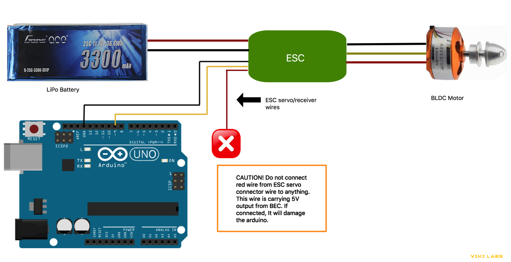

#### ESC Controller Library for arduino. This code is tested with arduino uno.

**Functionality:**

    1. Calibrate:
       This feature calibrates esc with minimum and maximum pulse width for lowest speed and highest speed. 
       It also calibrates the arming pulse width.
        
       Calibration is acheived using calibrate() method.
	
    2. Arm:
       Arm ESC. It is similar to initializing ESC to start its operation. 
       Arming is done using arm() method.

    3. Speed:
       Conntrol the speed of BLDC motor using set_speed() method.
	 
    4. Disarm:
       Disarm ESC. Once disarm is called. ESC will not be functional until arm() is called. 
       Disarm is done using disarm() method.

#### Wiring Diagram

**Caution:**

    Do not connect the red wire from ESC signal/servo/receiver wires. The red wire carries 5V DC from 
    BEC(Battery Eliminator Circuit) of ESC.

**Examples:**

    1. calibrate.ino:
       This code should be run first. It is used to calibrate ESC. You can change the min, max and 
       arm pulse width. 

    2. control_speed.ino
       This code arms ESC and start running the motor at the lowest speed. 

#### Compining code using Arduino IDE:

	- Create a folder named calibrate in your home directory(~)
	- Copy examples/01.Calibrate/calibrate.ino  to ~/calibrate
	- Copy src/esc_controller.cpp to ~/calibrate
	- Copy src/esc_controller.hpp to ~/calibrate
	- Start Arduino IDE
	- Goto File-> Open
	- Select file ~/calibrate/calibrate.ino
	- Now the code and the supporting library is visible in arduino IDE
	- To compile the code Goto Sketch-> Select "Verify/Compile"
	
#### Uploading code to Arduino UNO:

	- Open Arduino IDE, Goto Tools-> Board-> Select "Arduino/Genuino Uno"
	- Goto Tools -> Port -> Select "/dev/ttyACM3 (Arduino/Genuino Uno)" 
	  #The device name may vary, choose accordingly
	- Goto Tools -> Programmer -> Select "AVRISP mkll"
	- Now settings is completed. 
	- To upload the code Goto Sketch-> Select "Upload" 

